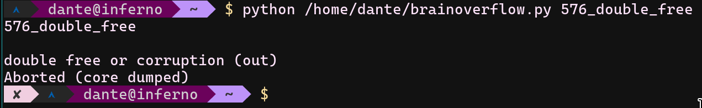

# brainflow-fuzz
an attempt to fuzz stream write/read 


## Test `cpp` harness locally 

1) `git clone https://github.com/brainflow-dev/brainflow.git`
2) `mkdir build`
3) `cd build`
4) `cmake -DCMAKE_CXX_COMPILER=afl-clang-fast++ ..`
5) create `Makefile` & save

6) Prepare [harness.cpp](./harness.cpp)

```
test_harness: harness.cpp
	afl-clang-fast++ -v harness.cpp $(INC) ./CMakeFiles/BoardController.dir/third_party/ant_neuro/eemagine/sdk/wrapper.cc.o -o harness  $(INCC) $(INCCC) -I../third_party/json/
```
7) run afl-fuzz with default settings: `AFL_AUTORESEUME=1 afl-fuzz -D -L0 -i samples/ -t 80 -o sync_dir -M fuzzer00 -- ./harness @@`

### Compile the test binary if compiled successfully

1) `make test_brain`
2) `./test` [test](./test.cpp)

```
##########################
###############TEST-CASE##

INCC = \
       $(shell find ../cpp_package/ -type d -name "inc" | sed s/^/-I/)
INCCC = \
       $(shell find ../src/ -type d -name "inc" | sed s/^/-I/)
INC = \
       $(shell find . -type f -name "*.cpp.o" | sed 's/^/ /')

test_brain: test.cpp
	afl-clang-fast++ -v test.cpp $(INC) ./CMakeFiles/BoardController.dir/third_party/ant_neuro/eemagine/sdk/wrapper.cc.o -o test  $(INCC) $(INCCC) -I../third_party/json/
#########################
```


# Test files against python

1) `python -m pip install brainflow`
2) run `brainflow.py <CRASHER_NAME>` script with a sample
3) some files are working on `python` library, some of them are crashing on `cpp`

## Reproducing `id:000016,sig:07,src:000010,time:28990834,execs:64400173,op:MOpt_havoc,rep:8` (576) file

1) This file also crashes `cpp` one but in python it is acting little bit weird, i couldnt manage to find the right time to analyze it to find out the root cause yet.
You have to test this file with full path of `brainflow.py` for ex: `/home/user/brainflow.py id:000016,sig:07,src:000010,time:28990834,execs:64400173,op:MOpt_havoc,rep:8`



# [Table of What-Crashes-Where](./STATS.md)


